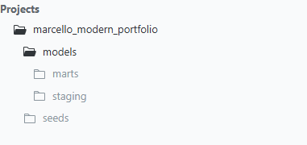
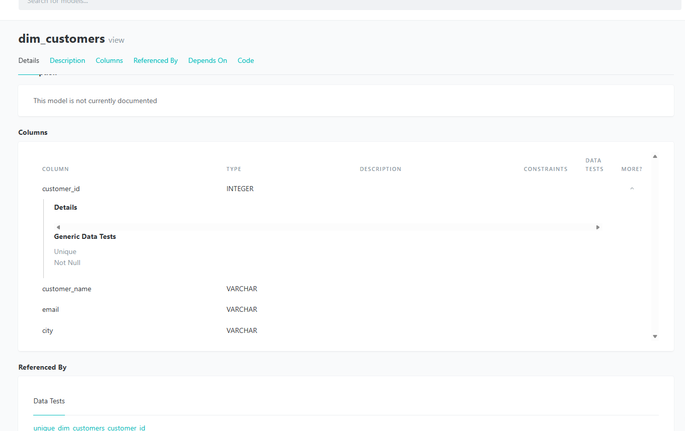

# Marcello Modern SQL Portfolio (dbt + DuckDB)

Modern, free SQL analytics engineering portfolio built with:
- **dbt Core** (models, tests, docs)
- **DuckDB** (local warehouse file)
- **SQLFluff** (optional linting)

## What this demonstrates
- Layered modeling: **seeds → staging → marts**
- Data quality: **dbt tests** (not_null, unique, relationships)
- Documentation & lineage: **dbt docs DAG**

## Project structure
- `marcello_modern_portfolio/` — dbt project
- `warehouse.duckdb` — local DuckDB database (generated)
- `screenshots/` — docs screenshots for quick review

## Lineage (dbt docs)


## Example model


## How to run locally (Windows)
```powershell
cd D:\Coding\GitHub\Marcello-Modern-SQL-Portfolio
.\.venv\Scripts\Activate.ps1
cd marcello_modern_portfolio
dbt seed
dbt build
dbt docs generate
dbt docs serve
